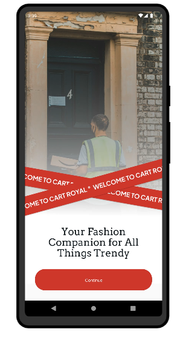
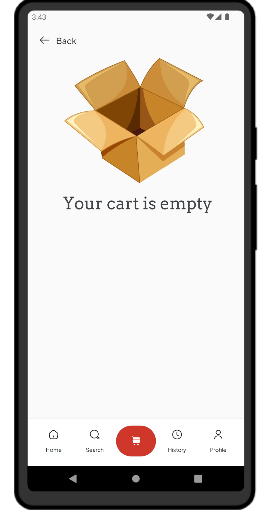

# My React Native Shopping App


A React Native application for shopping that allows users to browse products, add them to a cart, and proceed to checkout using the timbu api.

## Table of Contents

- [Features](#features)
- [Screenshots](#screenshots)
- [Installation](#installation)
- [Usage](#usage)
- [Download](https://expo.dev/artifacts/eas/nF7LFZdkSV5bKKjTwvqhti.apk)
- [License](#license)

## Features

- Browse products
- Add products to the cart
- View cart items
- Checkout

## Screenshots

### Products Screen




### Cart Screen


### Checkout Screen



## Installation

### Prerequisites

- Node.js >= 14.x
- npm >= 6.x or yarn >= 1.x
- Expo CLI

### Setup Instructions

1. **Clone the repository**

```bash
git clone https://github.com/Timi-Leyin/store-mobile.git
cd store-mobile
yarn install
yarn start
```
